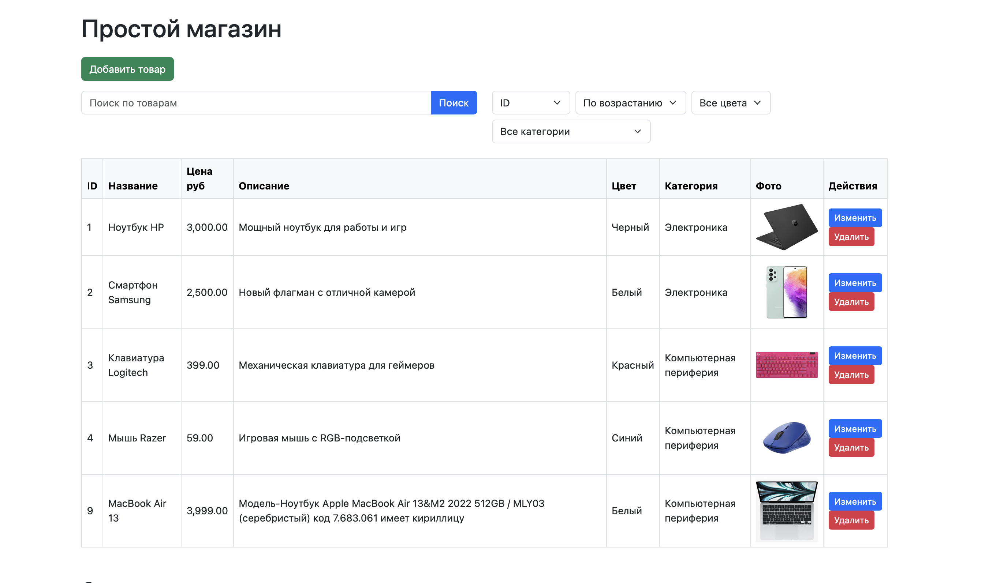
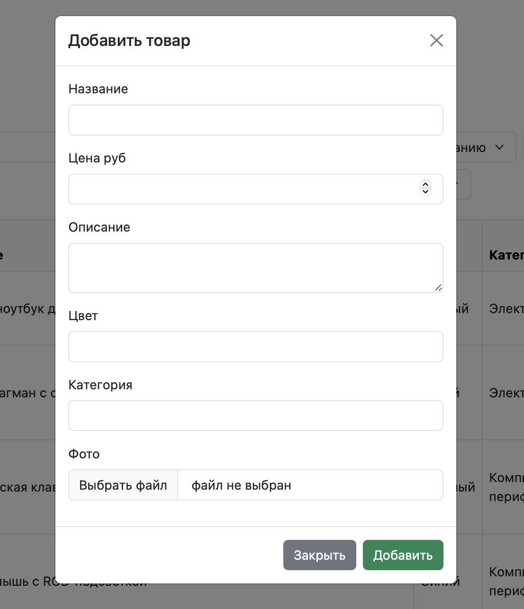
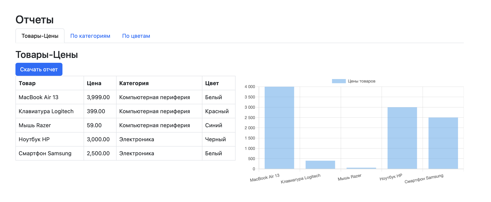

  <h1>🛒 Простой магазин</h1>
  <h3>Минималистичный интерфейс для учета товаров | Учебный проект</h3>
  
  

    
    
  

  
  

    
    
    
    
  

---

## 📌 О проекте
Мини-магазин с **полным CRUD-функционалом** (Create, Read, Update, Delete):  
- ✅ Добавление/удаление товаров через модальные окна  
- ✅ Редактирование существующих позиций  
- ✅ Фильтрация и просмотр отчетов  
- ✅ Простая PHP-обработка форм + MySQL  

---

## 🖥️ Скриншоты

  <h3>Главная страница с товарами</h3>
  
  
  <h3>Добавление нового товара (модальное окно)</h3>  
  
  
  <h3>Отчеты и статистика</h3>
  

---

## 🛠️ Технические детали
**Стек:**  
- Бэкенд: PHP + MySQL  
- Фронтенд: HTML/CSS, Vanilla JS  
- Архитектура: Монолит (без фреймворков)  

  

